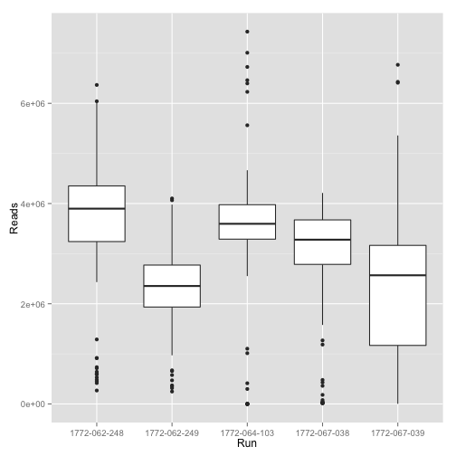
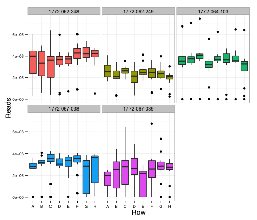
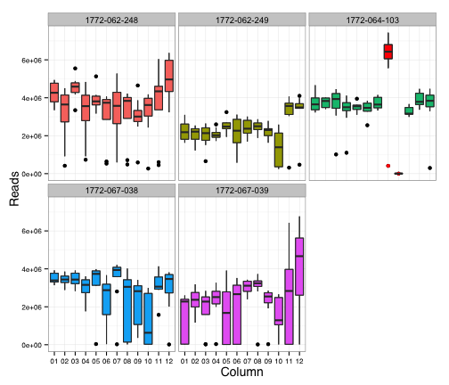

Quality control of HiSeq runs before alignment
==============================================

Summary
-------

 - Yield is comparable between runs.

 - There is an obvious defect, however, which is the mixing of rows `08` and `09`
   in run `1772-064-103`.  This is indicated by a `FALSE` value in the column
   `HiSeq_QC`.

 - Libraries with less than 100,000 pairs are also very likely to be
   problematic and are flagged `FALSE` in `HiSeq_QC`.


Datasets
--------

The `Demultiplex_Stats.html` files from the _Basecall Stats_ directory of the
HiSeq runs were copied and renamed with their run ID, opened in a web browser,
and the table inside was pasted in LibreOffice, edited and saved in _xslx_
format before loading into `R`.

 - `1772-067-038` and `1772-067-039` C1 runs: HiSeq run ID [140305_700213F_0043_BH0TMJADXX](./140305_700213F_0043_BH0TMJADXX.html).

 - `1772-064-103` C1 run: HiSeq run ID [140124_SN7001394_0068_AH0TK5ADXX](./140124_SN7001394_0068_AH0TK5ADXX.html).

 - `1772-062-248` and `1772-062-249` C1 runs: HiSeq run ID [131205_SN7001394_0065_BH0BG5ADXX](./131205_SN7001394_0065_BH0BG5ADXX.html).

The edition in LibreOffice was as follows:

 - Added a `Run` column, with the C1 run ID.

 - Renamed the `Sample ID` value for the _Undetermined_ sequences `Undetermined`.
   Example: `lane1` renamed to `Undetermined`.

 - For the same lines, renamed the `Description` value to our facility's internal ID.
   Example: `Clusters with unmatched barcodes for lane 1 ` renamed to `LS2079`.

 - For 1772-062-248 and 1772-062-249, entered the `Sample ID` by hand, using
   same indexes as for the libraries sequenced later.

The files were then collated in a single Excel file, `HiSeq.xslx`.


Quality control
---------------


```r
library(gdata)
library(ggplot2)
```

### Load data


```r
qc <- read.xls( "HiSeq.xlsx",
  col.names=c(
    'Run',
    'Lane',
    'Sample.ID',
    'Sample.Ref',
    'Barcode',
    'Description',
    'Control',
    'Project',
    'Yield',
    'Percent.PF',
    'Reads',
    'raw.clusters.per.lane',
    'Perfect.Index.Reads',
    'One.Mismatch.Index.Reads',
    'Q30.bases',
    'Mean.Quality.Score'))
```

The `Sample.ID` column contains identifiers made of the library ID attributed
by our facility, followed by `-`, follow by a well ID in 96-well plate format.

`Row` and `Column` refer to the coordinates in the 96-well plates (where the multiplexing reaction
was done).


```r
qc$Lane <- factor(qc$Lane)
qc$Well <- factor(sub('RNhi.....-', '', qc$Sample.ID))
qc[qc$Well == 'Undetermined', 'Well'] <- NA
qc$Row    <- factor(substr(qc$Well, 1, 1))
qc$Column <- factor(substr(qc$Well, 2, 3))
qc$Q30.bases <- as.numeric(as.character(qc$Q30.bases))
qc$Mean.Quality.Score <- as.numeric(as.character(qc$Mean.Quality.Score))
qc$Library <- sub('-...','', qc$Sample.ID)
qc$Library <- factor(qc$Library)

summary(qc)
```

```
##            Run     Lane            Sample.ID     Sample.Ref               Barcode    Description
##  1772-062-248:97   1:194   Undetermined :  5   custom :288   AAGAGGCA-AAGGAGTA:  5   LS2026:97  
##  1772-062-249:97   2:291   RNhi10371-A01:  1   hg19   :192   AAGAGGCA-ACTGCATA:  5   LS2027:97  
##  1772-064-103:97           RNhi10371-A02:  1   unknown:  5   AAGAGGCA-AGAGTAGA:  5   LS2069:97  
##  1772-067-038:97           RNhi10371-A03:  1                 AAGAGGCA-CTAAGCCT:  5   LS2079:97  
##  1772-067-039:97           RNhi10371-A04:  1                 AAGAGGCA-CTCTCTAT:  5   LS2080:97  
##                            RNhi10371-A05:  1                 AAGAGGCA-GTAAGGAG:  5              
##                            (Other)      :475                 (Other)          :455              
##  Control                   Project       Yield          Percent.PF      Reads         
##  N:485   LS2026_RNhi10371_Lane1:96   Min.   :   0.0   Min.   :100   Min.   :       0  
##          LS2027_RNhi10372_Lane2:96   1st Qu.: 341.0   1st Qu.:100   1st Qu.: 2256610  
##          LS2069_RNhi10395_Lane2:96   Median : 477.0   Median :100   Median : 3161038  
##          LS2079_RNhi10396_Lane1:96   Mean   : 454.3   Mean   :100   Mean   : 3008378  
##          LS2080_RNhi10397_Lane2:96   3rd Qu.: 575.0   3rd Qu.:100   3rd Qu.: 3807756  
##          Undetermined_indices  : 5   Max.   :2774.0   Max.   :100   Max.   :18372764  
##                                                       NA's   :5                       
##  raw.clusters.per.lane Perfect.Index.Reads One.Mismatch.Index.Reads   Q30.bases    
##  Min.   :0.000         Min.   :  0.00      Min.   :0                Min.   :43.38  
##  1st Qu.:0.890         1st Qu.:100.00      1st Qu.:0                1st Qu.:74.73  
##  Median :1.070         Median :100.00      Median :0                Median :82.14  
##  Mean   :1.031         Mean   : 98.96      Mean   :0                Mean   :79.84  
##  3rd Qu.:1.240         3rd Qu.:100.00      3rd Qu.:0                3rd Qu.:86.39  
##  Max.   :6.610         Max.   :100.00      Max.   :0                Max.   :92.29  
##                        NA's   :5           NA's   :5                NA's   :5      
##  Mean.Quality.Score      Well          Row          Column            Library  
##  Min.   :17.15      A01    :  5   A      : 60   01     : 40   RNhi10371   :96  
##  1st Qu.:30.25      A02    :  5   B      : 60   02     : 40   RNhi10372   :96  
##  Median :32.40      A03    :  5   C      : 60   03     : 40   RNhi10395   :96  
##  Mean   :31.60      A04    :  5   D      : 60   04     : 40   RNhi10396   :96  
##  3rd Qu.:33.46      A05    :  5   E      : 60   05     : 40   RNhi10397   :96  
##  Max.   :35.30      (Other):455   (Other):180   (Other):280   Undetermined: 5  
##  NA's   :5          NA's   :  5   NA's   :  5   NA's   :  5
```


### Quantity of demultiplexed and unmatched paired-end reads.

The report files also provide information on non-demultiplexed reads, in lines
where `Sample.ID` equals `Undetermined`.  This creates `NA` values in the
`Well` column.


```r
Unmatched <- factor(is.na(qc$Well), labels=c('Demultiplexed', 'Unmatched'))
tapply(qc$Reads, list(qc$Run, Unmatched), sum) / 2
```

```
##              Demultiplexed Unmatched
## 1772-062-248     172535190   9186382
## 1772-062-249     111324618   4501123
## 1772-064-103     165469933   5797198
## 1772-067-038     135259989   7015177
## 1772-067-039     110618416   7823575
```

The numbers are divided by two because the number of reads reported is
paired-end (two reads per pair).


### Looking for run bias


```r
qplot(data = qc[!is.na(qc$Well),], Run, Reads, geom = "boxplot")
```

 

### Looking for position bias in the plates

Do not worry too much about the shape of the boxplots, this is because there
are few points per run (8 for columns and 12 for rows).


```r
qplot(data = qc[!is.na(qc$Well),], Row, Reads, geom = "boxplot") +
  facet_wrap(~Run) + theme_bw() +
  theme(axis.title = element_text(size=14, family="Helvetica"),
        axis.text = element_text(size=8, family="Helvetica"),
        legend.position="none") + 
  geom_boxplot(data=qc[!is.na(qc$Well),], aes(x = Row, y = Reads, fill=Run))
```

 

```r
qplot(data = qc[!is.na(qc$Well),], Column, Reads, geom = "boxplot") + 
  facet_wrap(~Run) + theme_bw() +
  theme(axis.title = element_text(size=14, family="Helvetica"),
        axis.text = element_text(size=8, family="Helvetica"),
        legend.position="none") + 
  geom_boxplot(data=qc[!is.na(qc$Well),], aes(x = Column, y = Reads, fill=Run)) +
  geom_boxplot(data=qc[!is.na(qc$Well) & qc$Run == '1772-064-103' & qc$Column == '08',], aes(x = Column, y = Reads), fill="red",     outlier.colour = "red") +
  geom_boxplot(data=qc[!is.na(qc$Well) & qc$Run == '1772-064-103' & qc$Column == '09',], aes(x = Column, y = Reads), fill="red", outlier.colour = "red")
```

 

In C1 run `1772-064-103`, the plate column `09` has clearly been pipetted in
row `08`.  Both of them are flagged `FALSE` in a table column called `HiSeq_QC`
to mark that fact.


```r
qc$HiSeq_QC <- TRUE
qc[qc$Run == '1772-064-103' & grepl('0[89]', qc$Well), 'HiSeq_QC'] <- FALSE
```

### Libraries with less than 100,000 pairs.

The libraries with less than 200,000 reads (one pair is two reads) are likely
to be problematic or too shallow in comparison with the others, and therefore
flagged `FALSE` for the quality control.


```r
qc[qc$Reads < 200000, 'HiSeq_QC'] <- FALSE
```

Export table in CSV format.
---------------------------

Drop columns that contain the same value for each library.


```r
qc <- qc[,-grep('One.Mismatch.Index.Reads', colnames(qc))]
qc <- qc[,-grep('Control', colnames(qc))]
```

Rename `Description` to `LSID` to avoid name conflicts with the fluorescence data.


```r
colnames(qc) <- sub('Description', 'LSID', colnames(qc))
```

Write the table in CSV format.


```r
qc$cell_id <- paste(qc$Run, qc$Well, sep = "_")
summary(qc)
```

```
##            Run     Lane            Sample.ID     Sample.Ref               Barcode        LSID   
##  1772-062-248:97   1:194   Undetermined :  5   custom :288   AAGAGGCA-AAGGAGTA:  5   LS2026:97  
##  1772-062-249:97   2:291   RNhi10371-A01:  1   hg19   :192   AAGAGGCA-ACTGCATA:  5   LS2027:97  
##  1772-064-103:97           RNhi10371-A02:  1   unknown:  5   AAGAGGCA-AGAGTAGA:  5   LS2069:97  
##  1772-067-038:97           RNhi10371-A03:  1                 AAGAGGCA-CTAAGCCT:  5   LS2079:97  
##  1772-067-039:97           RNhi10371-A04:  1                 AAGAGGCA-CTCTCTAT:  5   LS2080:97  
##                            RNhi10371-A05:  1                 AAGAGGCA-GTAAGGAG:  5              
##                            (Other)      :475                 (Other)          :455              
##                    Project       Yield          Percent.PF      Reads         
##  LS2026_RNhi10371_Lane1:96   Min.   :   0.0   Min.   :100   Min.   :       0  
##  LS2027_RNhi10372_Lane2:96   1st Qu.: 341.0   1st Qu.:100   1st Qu.: 2256610  
##  LS2069_RNhi10395_Lane2:96   Median : 477.0   Median :100   Median : 3161038  
##  LS2079_RNhi10396_Lane1:96   Mean   : 454.3   Mean   :100   Mean   : 3008378  
##  LS2080_RNhi10397_Lane2:96   3rd Qu.: 575.0   3rd Qu.:100   3rd Qu.: 3807756  
##  Undetermined_indices  : 5   Max.   :2774.0   Max.   :100   Max.   :18372764  
##                                               NA's   :5                       
##  raw.clusters.per.lane Perfect.Index.Reads   Q30.bases     Mean.Quality.Score      Well    
##  Min.   :0.000         Min.   :  0.00      Min.   :43.38   Min.   :17.15      A01    :  5  
##  1st Qu.:0.890         1st Qu.:100.00      1st Qu.:74.73   1st Qu.:30.25      A02    :  5  
##  Median :1.070         Median :100.00      Median :82.14   Median :32.40      A03    :  5  
##  Mean   :1.031         Mean   : 98.96      Mean   :79.84   Mean   :31.60      A04    :  5  
##  3rd Qu.:1.240         3rd Qu.:100.00      3rd Qu.:86.39   3rd Qu.:33.46      A05    :  5  
##  Max.   :6.610         Max.   :100.00      Max.   :92.29   Max.   :35.30      (Other):455  
##                        NA's   :5           NA's   :5       NA's   :5          NA's   :  5  
##       Row          Column            Library    HiSeq_QC         cell_id         
##  A      : 60   01     : 40   RNhi10371   :96   Mode :logical   Length:485        
##  B      : 60   02     : 40   RNhi10372   :96   FALSE:47        Class :character  
##  C      : 60   03     : 40   RNhi10395   :96   TRUE :438       Mode  :character  
##  D      : 60   04     : 40   RNhi10396   :96   NA's :0                           
##  E      : 60   05     : 40   RNhi10397   :96                                     
##  (Other):180   (Other):280   Undetermined: 5                                     
##  NA's   :  5   NA's   :  5
```

```r
write.csv(file='HiSeq.csv', qc, row.names=FALSE)
```
