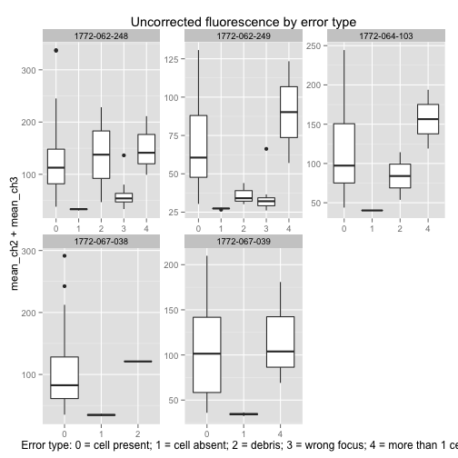
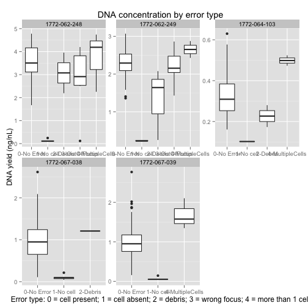
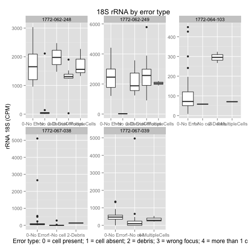
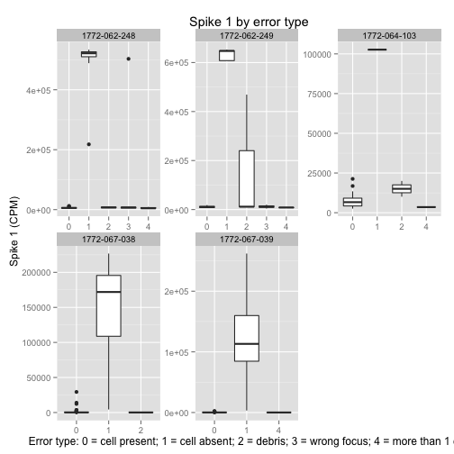
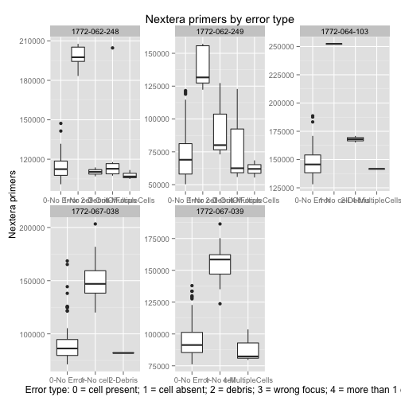
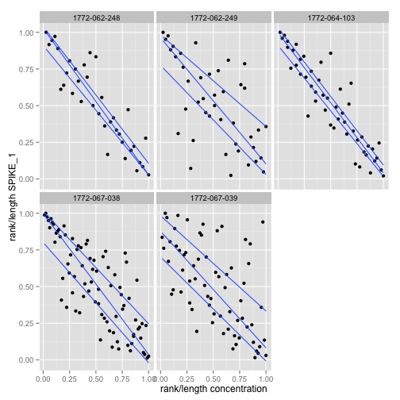
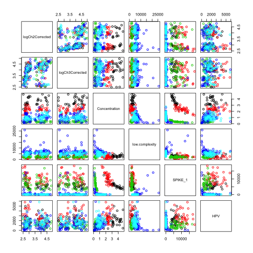
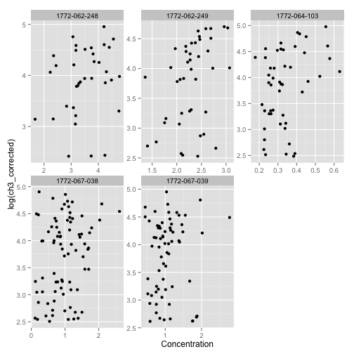

<a name='top'>Combined analysis of Fucci fluorescence and cDNA concentration</a>
===============================================================================

Summary
-------

After [visual inspection](#no-cell_fluorescence), chambers with no cells or
with defect in the imaging were flagged for removal. The [DNA
yield](#no-cell_DNA-yield) for the same chambers was also very low.
Conversely, in the absence of cells, the proportion of
[spikes](#no-cell_spikes) was highest. This confirms the accuracy of the
visual inspection and confirms that the conversion between C1 chip coordinates
and 96-well plate coordinates was done correctly.

In the output file `combined.csv`, a column called `Discard` indicates if the
cell fails any of the quality controls.

Datasets
--------

 - The non corrected fluorescence values are produced as explained in
   [Fluorescence-measured-in-ImageJ.html](fluorescence/Fluorescence-measured-in-ImageJ.html).
 - The background and batch effect correction of the fluorescence values is explained 
   in [BackgroundCorrection.html](Intensity_correction/BackgroundCorrection.html)
 - The cDNA concentration values are produced as explained in
   [cDNA_concentration.html](cDNA_concentration/concentration_QC.html).
 - Normalised spike counts: `control-sequences/spikes.norm.csv`, see [control-sequences.html](control-sequences/control-sequences.html).
 - Location of the positive and negative controls: `controls.csv`, as indicated
   by the operators T. K., (email on Mon, 24 Mar 2014 20:06:36 +0900) and
   S. K. (e-mail on Tue, 25 Mar 2014 09:02:50 +0900).

Quality control
---------------


```r
library(gdata)   # for drop.levels()
library(ggplot2) # for the plots
library(scales)  # for trans_new()
```

### Load and merge the fluorescence and concentration values

The `qc` table is assembled by merging multiple data sources.  It is then saved
as `qc.full`.  In the steps that follow, entries that do not pass quality
controls will be removed from the `qc` table.


```r
fl <- read.csv("../fluorescence/Results_fluorescence.csv")
fl$Error <- factor(fl$Error)
fl <- fl[,c(1,28,30,31,32,5,12,17,24)]

correctedFl <- read.csv('../Intensity_correction/correctedIntensities.csv')
correctedFl <- correctedFl[,c(1,9,10)]

qc <- merge(fl, correctedFl, by='cell_id', all=TRUE)

# pg as short name for picogreen
pg <- read.csv('../cDNA_concentration/cDNA_concentration.csv')
pg$Column <- factor(pg$Column)
pg$cell_id <- paste(pg$Run, pg$Well, sep='_')
qc <- merge(pg, qc, by=c('cell_id', 'Run', 'Well'), all=TRUE)

spikes <- read.csv('../control-sequences/spikes.norm.csv')
qc <- merge(qc, spikes, all=TRUE)

controls <- read.csv('../combine_all/controls.csv')
summary(controls)
```

```
##            Run         Well   Control
##  1772-062-248:2   A02    :2   NC:5   
##  1772-062-249:2   A10    :1   PC:5   
##  1772-064-103:2   B01    :1          
##  1772-067-038:2   C09    :1          
##  1772-067-039:2   F08    :1          
##                   F12    :1          
##                   (Other):3
```

```r
controls$cell_id <- paste(controls$Run, controls$Well, sep='_')
qc <- merge(qc, controls, by=c('cell_id', 'Run', 'Well'), all=TRUE)
rownames(qc) <- qc$cell_id

hiseq <- read.csv('../HiSeq/HiSeq.csv')
hiseq <- hiseq[,c(1,10, 15:17,19,20)]
qc <- merge(qc, hiseq, by=c('cell_id', 'Run', 'Well', 'Row', 'Column'))

# replace error type with numbers
error <- sapply(strsplit(as.character(qc$Error),"-", fixed = TRUE),"[[", 1)
qc$Error <- error
  
qc.full <- qc
```

### Remove the samples that were replaced by positive or negative controls.


```r
qc <- subset(qc, is.na(qc$Control))
```

### Visual curation

Visual curation of the fluorescence pictures (`Error` field, see
[Fluorescence-measured-in-ImageJ.html](fluorescence/Fluorescence-measured-in-ImageJ.html)) eliminated the chambers
where it was not sure wether a healthy single cell was captured, in good concordance with the DNA yields.
In the absence of a cell the libraries are mostly made of spikes.


#### <a name='no-cell_fluorescence'>Fluorescence.</a>
### Remove the cells for which there are no image files.


```r
qc <- subset(qc, !is.na(qc$Error))
```


```r
qplot(data = qc, Error, mean_ch2 + mean_ch3, geom = "boxplot"
) + facet_wrap(~Run, scales = "free") + ggtitle('Uncorrected fluorescence by error type') + scale_x_discrete('Error type: 0 = cell present; 1 = cell absent; 2 = debris; 3 = wrong focus; 4 = more than 1 cell')
```

 
[Back to top](#top)

#### <a name='no-cell_DNA-yield'>DNA concentration.</a>


```r
qplot(data = qc, Error, Concentration, geom = "boxplot", fill=Run) + 
  facet_wrap(~Run, scales = "fixed") + 
#  ggtitle('cDNA concentration by error type') + 
#  scale_x_discrete('Error type: 0 = cell present; 1 = cell absent; 2 = debris; 3 = wrong focus; 4 = more than 1 cell') + 
  scale_y_continuous('cDNA concentration') +
  theme_bw() +
  theme(axis.title = element_text(size=14, family="Helvetica"),
        axis.text = element_text(size=8, family="Helvetica"),
        legend.position="none")
```

 
[Back to top](#top)

#### <a name='no-cell_rRNA'>18S rRNA.</a>


```r
qplot(data = qc, Error, rRNA_18S, geom = "boxplot"
) + facet_wrap(~Run, scales = "free") + ggtitle('18S rRNA by error type') + scale_x_discrete('Error type: 0 = cell present; 1 = cell absent; 2 = debris; 3 = wrong focus; 4 = more than 1 cell') + scale_y_continuous('rRNA 18S (CPM)')
```

```
## Warning: Removed 5 rows containing non-finite values (stat_boxplot).
```

 

[Back to top](#top)

#### <a name='no-cell_spikes'>Spike 1.</a>


```r
qplot(data = qc, Error, SPIKE_1, geom = "boxplot", fill=Run) + 
  facet_wrap(~Run, scales = "fixed") + 
#  ggtitle('Spike 1 by error type') + 
#  scale_x_discrete('Error type: 0 = cell present; 1 = cell absent; 2 = debris; 3 = wrong focus; 4 = more than 1 cell') + 
  scale_y_continuous('Spike 1 (CPM)') +
  theme_bw() +
  theme(axis.title = element_text(size=14, family="Helvetica"),
        axis.text = element_text(size=8, family="Helvetica"),
        legend.position="none")
```

```
## Warning: Removed 5 rows containing non-finite values (stat_boxplot).
```

 

#### <a name='no-cell_Nextera'>Nextera primers.</a>


```r
qplot(data = qc, Error, Nextera, geom = "boxplot") + facet_wrap(~Run, scales = "free") + ggtitle('Nextera primers by error type') + scale_x_discrete('Error type: 0 = cell present; 1 = cell absent; 2 = debris; 3 = wrong focus; 4 = more than 1 cell') + scale_y_continuous('Nextera primers')
```

```
## Warning: Removed 5 rows containing non-finite values (stat_boxplot).
```

 

### Median DNA yield

The DNA yield of chambers with no cells varies from run to run.  Note that all
chambers contain spikes, so the yield will not be null.


```r
yield <- with(subset(qc, as.character(Error) < 2), tapply(Concentration, list(Run, drop.levels(Error)), median))
colnames(yield) <- c('one cell', 'no cell')
yield
```

```
##              one cell no cell
## 1772-062-248   3.5050  0.1080
## 1772-062-249   2.2910  0.2260
## 1772-064-103   0.3090  0.1020
## 1772-067-038   0.9490  0.0925
## 1772-067-039   0.9515  0.0520
```

### Removing chambers which failed fluorescence QC


```r
qc <- subset(qc, fluo_QC != TRUE,)
summary(qc)
```

```
##    cell_id                    Run          Well          Row         Column    Concentration  
##  Length:289         1772-062-248:36   C07    :  5   D      :50   1      : 26   Min.   :0.108  
##  Class :character   1772-062-249:42   D02    :  5   E      :39   2      : 26   1st Qu.:0.488  
##  Mode  :character   1772-064-103:57   D03    :  5   C      :38   7      : 26   Median :1.016  
##                     1772-067-038:82   D05    :  5   A      :36   9      : 26   Mean   :1.362  
##                     1772-067-039:72   D09    :  5   F      :36   4      : 24   3rd Qu.:2.030  
##                                       D12    :  5   B      :35   5      : 24   Max.   :4.781  
##                                       (Other):259   (Other):55   (Other):137                  
##     Error            fluo_QC           mean_ch2       bg_mean_ch2       mean_ch3     
##  Length:289         Mode :logical   Min.   : 16.70   Min.   :14.94   Min.   : 12.07  
##  Class :character   FALSE:289       1st Qu.: 26.60   1st Qu.:17.35   1st Qu.: 26.34  
##  Mode  :character   NA's :0         Median : 34.97   Median :22.12   Median : 48.99  
##                                     Mean   : 46.85   Mean   :21.30   Mean   : 53.07  
##                                     3rd Qu.: 65.94   3rd Qu.:23.10   3rd Qu.: 71.63  
##                                     Max.   :135.99   Max.   :27.25   Max.   :177.03  
##                                                                                      
##   bg_mean_ch3     ch2_corrected    ch3_corrected    low.complexity        SPIKE_1        
##  Min.   : 9.701   Min.   : 10.70   Min.   : 11.22   Min.   :   514.9   Min.   :   28.66  
##  1st Qu.:12.686   1st Qu.: 14.81   1st Qu.: 23.28   1st Qu.:  2348.4   1st Qu.:  158.84  
##  Median :13.234   Median : 22.25   Median : 51.44   Median :  4059.9   Median : 1173.60  
##  Mean   :13.678   Mean   : 38.83   Mean   : 53.90   Mean   :  5287.3   Mean   : 4044.16  
##  3rd Qu.:14.358   3rd Qu.: 57.97   3rd Qu.: 78.62   3rd Qu.:  5828.2   3rd Qu.: 6957.50  
##  Max.   :22.664   Max.   :128.22   Max.   :145.18   Max.   :253685.6   Max.   :29382.25  
##                                                     NA's   :4          NA's   :4         
##     SPIKE_4             SPIKE_7          SPIKE_3           SPIKE_6            rRNA_18S      
##  Min.   :   0.0000   Min.   :  0.00   Min.   : 0.0000   Min.   :0.000000   Min.   :   0.00  
##  1st Qu.:   0.3359   1st Qu.:  0.00   1st Qu.: 0.0000   1st Qu.:0.000000   1st Qu.:  67.73  
##  Median :  24.0277   Median :  0.00   Median : 0.0000   Median :0.000000   Median : 314.87  
##  Mean   : 273.6173   Mean   : 25.09   Mean   : 0.8069   Mean   :0.008203   Mean   : 772.45  
##  3rd Qu.: 495.8608   3rd Qu.: 34.26   3rd Qu.: 0.0000   3rd Qu.:0.000000   3rd Qu.:1209.21  
##  Max.   :1665.7146   Max.   :273.32   Max.   :75.3734   Max.   :1.283028   Max.   :5107.16  
##  NA's   :4           NA's   :4        NA's   :4         NA's   :4          NA's   :4        
##     rRNA_28S         rRNA_5.8S          Nextera            HPV             HPV_as       Control   
##  Min.   :   0.00   Min.   : 0.0000   Min.   : 50318   Min.   :   0.0   Min.   :   0.0   NC  :  0  
##  1st Qu.:  18.14   1st Qu.: 0.0000   1st Qu.: 82841   1st Qu.: 893.9   1st Qu.: 328.5   PC  :  0  
##  Median :  50.36   Median : 0.6358   Median : 95233   Median :1460.1   Median : 512.9   NA's:289  
##  Mean   :  59.10   Mean   : 1.5019   Mean   :103690   Mean   :1641.3   Mean   : 578.5             
##  3rd Qu.:  82.77   3rd Qu.: 1.8737   3rd Qu.:122796   3rd Qu.:2146.5   3rd Qu.: 760.2             
##  Max.   :1119.20   Max.   :20.0407   Max.   :188657   Max.   :5904.7   Max.   :2166.2             
##  NA's   :4         NA's   :4         NA's   :4        NA's   :4        NA's   :4                  
##      Reads          HiSeq_QC      
##  Min.   :      0   Mode :logical  
##  1st Qu.:2613214   FALSE:10       
##  Median :3275860   TRUE :279      
##  Mean   :3204306   NA's :0        
##  3rd Qu.:3766192                  
##  Max.   :7430660                  
## 
```

### Removing chambers which were affected by pipetting errors.

The libraries with pipetting errors failed the [HiSeq QC](HiSeq/HiSeq.html).


```r
qc <- subset(qc, HiSeq_QC == TRUE)
```

### Removing low-complexity libraries.

Some libraries in run 1772-067-039 are outliers with low yield, no fluorescence and higher proportion
of low-complexity reads, therefore we remove them.


```r
summary(subset(qc, low.complexity > 9000 & Run == '1772-067-039'))
```

```
##    cell_id                    Run         Well        Row        Column  Concentration   
##  Length:4           1772-062-248:0   B10    :1   B      :1   10     :3   Min.   :0.1580  
##  Class :character   1772-062-249:0   C02    :1   C      :1   2      :1   1st Qu.:0.1857  
##  Mode  :character   1772-064-103:0   G10    :1   G      :1   1      :0   Median :0.2220  
##                     1772-067-038:0   H10    :1   H      :1   3      :0   Mean   :0.2195  
##                     1772-067-039:4   A01    :0   A      :0   4      :0   3rd Qu.:0.2557  
##                                      A02    :0   D      :0   5      :0   Max.   :0.2760  
##                                      (Other):0   (Other):0   (Other):0                   
##     Error            fluo_QC           mean_ch2      bg_mean_ch2       mean_ch3      bg_mean_ch3   
##  Length:4           Mode :logical   Min.   :22.65   Min.   :21.25   Min.   :13.23   Min.   :13.15  
##  Class :character   FALSE:4         1st Qu.:22.96   1st Qu.:21.61   1st Qu.:13.27   1st Qu.:13.28  
##  Mode  :character   NA's :0         Median :23.32   Median :21.88   Median :13.50   Median :13.37  
##                                     Mean   :23.28   Mean   :21.82   Mean   :13.53   Mean   :13.35  
##                                     3rd Qu.:23.64   3rd Qu.:22.09   3rd Qu.:13.75   3rd Qu.:13.45  
##                                     Max.   :23.82   Max.   :22.26   Max.   :13.89   Max.   :13.52  
##                                                                                                    
##  ch2_corrected   ch3_corrected   low.complexity     SPIKE_1        SPIKE_4           SPIKE_7       
##  Min.   :11.56   Min.   :13.01   Min.   : 9987   Min.   :1174   Min.   : 0.8575   Min.   : 0.0000  
##  1st Qu.:12.40   1st Qu.:13.04   1st Qu.:10803   1st Qu.:1238   1st Qu.: 1.7202   1st Qu.: 0.6432  
##  Median :12.80   Median :13.40   Median :11279   Median :1565   Median :35.4370   Median : 6.0125  
##  Mean   :12.59   Mean   :13.40   Mean   :11127   Mean   :1686   Mean   :39.5316   Mean   : 8.5277  
##  3rd Qu.:13.00   3rd Qu.:13.76   3rd Qu.:11603   3rd Qu.:2012   3rd Qu.:73.2484   3rd Qu.:13.8971  
##  Max.   :13.19   Max.   :13.77   Max.   :11964   Max.   :2439   Max.   :86.3948   Max.   :22.0858  
##                                                                                                    
##     SPIKE_3     SPIKE_6     rRNA_18S        rRNA_28S        rRNA_5.8S         Nextera      
##  Min.   :0   Min.   :0   Min.   :245.7   Min.   : 65.87   Min.   :0.8575   Min.   :122796  
##  1st Qu.:0   1st Qu.:0   1st Qu.:391.8   1st Qu.: 79.71   1st Qu.:0.9124   1st Qu.:127052  
##  Median :0   Median :0   Median :444.1   Median : 84.97   Median :1.7484   Median :128875  
##  Mean   :0   Mean   :0   Mean   :401.4   Mean   : 84.46   Mean   :3.0964   Mean   :128515  
##  3rd Qu.:0   3rd Qu.:0   3rd Qu.:453.7   3rd Qu.: 89.72   3rd Qu.:3.9324   3rd Qu.:130339  
##  Max.   :0   Max.   :0   Max.   :471.6   Max.   :102.05   Max.   :8.0312   Max.   :133514  
##                                                                                            
##       HPV             HPV_as       Control      Reads         HiSeq_QC      
##  Min.   : 7.445   Min.   : 6.514   NC  :0   Min.   : 996116   Mode:logical  
##  1st Qu.:25.202   1st Qu.:18.946   PC  :0   1st Qu.:1054938   TRUE:4        
##  Median :44.288   Median :35.127   NA's:4   Median :1120336   NA's:0        
##  Mean   :44.107   Mean   :42.074            Mean   :1101460                 
##  3rd Qu.:63.193   3rd Qu.:58.255            3rd Qu.:1166858                 
##  Max.   :80.407   Max.   :91.527            Max.   :1169052                 
## 
```

```r
qc <- subset(qc, ! (low.complexity > 9000 & Run == '1772-067-039'))
```

Two libraries 1772-067-038 have quantities of spikes that are way higher than
the average, suggesting bad quality.  It is not sure whether they should be
removed from the final analysis, but removing them now helps the readability of
the plots below.


```r
#  Disabled: removing them causes one of the plots to crash due to problems on guessing the scale.
#subset(qc, Run == '1772-067-038' & SPIKE_1 > 1)
#summary(subset(qc, Run == '1772-067-038' & SPIKE_1 < 1, SPIKE_1))
#qc <- subset(qc, ! (Run == '1772-067-038' & SPIKE_1 > 1))
```

### There is an inverse correlation between the quantity of spike reads and the DNA yield.

If the spikes provide _S_ molcules and the cells provide _C_ molecules, then
the spike ration should be _S / (S − C)_, which also equals to _1 − C / (S +
C)_.  In addition, the DNA yield should be proportional to the total number of
molecules, _S + C_.  Therefore, the spike ratio, aproximated by the `SPIKE_1`
value, has an inverse relationship with the DNA yield, measured by the
`Concentration` value.


```r
ggplot(
  data=qc,
  aes(Concentration, SPIKE_1)) + 
  geom_point() + facet_wrap('Run', scale='free') + stat_quantile(formula='y ~ x')
```

 

```r
#ggplot(
#  data=qc,
#  aes(Concentration, SPIKE_1)) + 
#  geom_point() + facet_wrap('Run', scale='free') + stat_quantile(formula='y ~ x') + 
#  scale_x_continuous(trans = trans_new('inverse', transform = function(x) 1 / x, inverse = function(x) 1 / x), name='concentration (inverse scale)')

ggplot(
  data=qc,
  aes(
    ave(qc$Concentration, qc$Run, FUN = function(X) {rank(X) / length(X)}),
    ave(qc$SPIKE_1, qc$Run, FUN = function(X) {rank(X) / length(X)}))) + 
  geom_point()  + facet_wrap('Run') + stat_quantile(formula='y ~ x') +
  scale_x_continuous(name="rank/length concentration") +
  scale_y_continuous(name="rank/length SPIKE_1")
```

 

### Relation between fluorescence intensity and DNA concentration.


```r
with(qc,
  plot(
    data.frame(
      logCh2Corrected = log(ch2_corrected + 1),
      logCh3Corrected = log(ch3_corrected + 1),
      Concentration, low.complexity, SPIKE_1, HPV), col=Run))
```

 

```r
ggplot(data=qc, aes(Concentration, log(ch3_corrected))) + geom_point() + facet_wrap('Run', scale='free')
```

 

### Add a global QC flag and export the full table


```r
qc.full$Discard <- FALSE
qc.full[ !is.na(qc.full$Control), 'Discard'] <- TRUE
qc.full[ is.na(qc.full$fluo_QC), 'Discard'] <- TRUE
qc.full[ which(qc.full$fluo_QC == TRUE), 'Discard'] <- TRUE
qc.full[ !qc.full$HiSeq_QC, 'Discard'] <- TRUE

write.csv(qc.full, file='../combine_all/combined.csv', row.names=FALSE)
```

