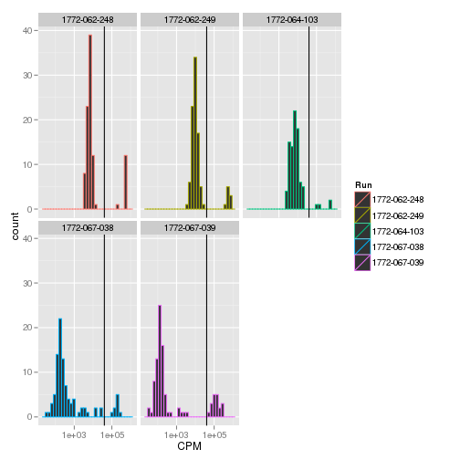
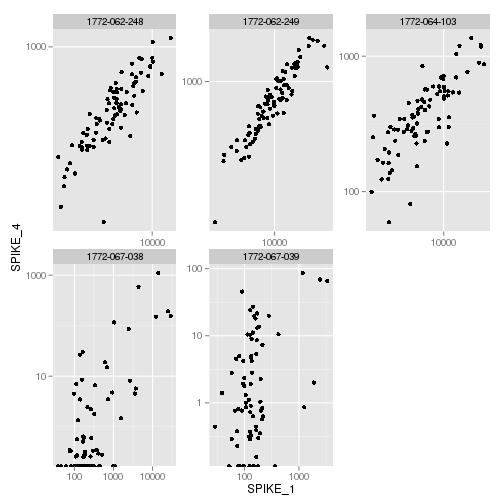
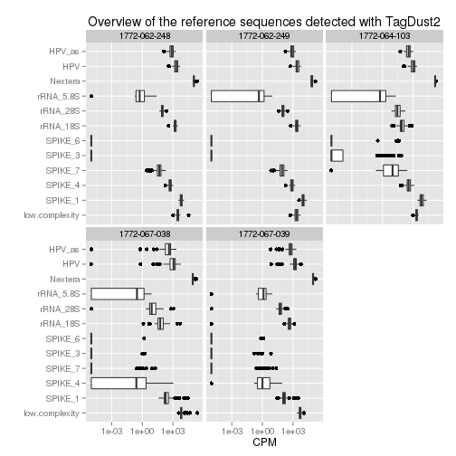

<a name='top'>Control sequence counts in the FASTQ reads</a>
============================================================

Summary
-------

Using the TagDust 2 program (<http://sourceforge.net/projects/tagdust/>), the
number of reads matching reference control sequences for the spikes, the rRNAs,
and the Nextera linkers are counted, normalised, and saved in a table.  This
table contains the following columns:

 - `cell_id`, identifying each cell uniquely. 
 - `low.complexity`, as defined by TagDust's filter.
 - `SPIKE_1`, `SPIKE_4`, `SPIKE_7`, `SPIKE_3`, `SPIKE_6`: the percentage of reads
    matching these spikes (Ambion ArrayControl, cat. num.
    [AM1780M](http://www.lifetechnologies.com/order/catalog/product/AM1780M))
 - `rRNA_5.8S`, `rRNA_18S`, `rRNA_28S`: expression levels of these rRNAs.
 - `Nextera`, for the artefacts derived from linker oligonucleotides.
 - `HPV` and `HPV_as`, for the transcripts originating from the Human Papilloma
    Virus 18. 

The unit for expression levels is counts per million (CPM).  Given that there
is a 3′ bias in the RNA-seq protocol used here, it is not advisable to
normalise by sequence length in addition.

In the last three runs, the detection levels of spikes and rRNA are lower than
in the first two runs (see the plot _[Overview of the reference sequences
detected with TagDust2](#low-everything)_).

The quantity of primer artefacts (called _Nextera_ below), is constant between
runs, at roughly 10 % of the total number of reads.  Note that TagDust only
inspects the first 32 bases of the reads, but that should be enough, and also
avoids calling _artefact_ a read that has a short insert and finishes in the
linker region.

Random inspection of file (matching the pattern `links_to_fastq/*A10*R1*
links_to_fastq/*B04*R1* links_to_fastq/*F09*R1*`) for presence of reads
aligning to the _Mycoplasma hominis_ genome (NC_013511) did not suggest
contamination of the cells.

Datasets
--------

### Files

 - Ambion spikes: `ArrayControl.nopolyA.fa`.  _Important:_ poly-A tails
   were removed from the reference file containing the spike sequences, to avoid
   artificial detection of A-rich reads as spikes.  The relative concentrations of
   the spikes are:
   - EC13 RNA SPIKE6 1250 bp: 1 ×
   - EC3 RNA SPIKE3 1000 bp: 10 ×
   - EC18 RNA SPIKE7 1474 bp: 100 ×
   - EC15 RNA SPIKE4 1000 bp: 1,000 ×
   - EC2 RNA SPIKE1 750 bp: 10,000 ×

 - `rRNA.fa`: sequence from the 5.8S, 18S and 28S rRNA according to GenBank U13369.1.

 - `Nextera.fa`: sequence of the Nextera primers according to <http://support.illumina.com/downloads/illumina-customer-sequence-letter.html>.

 - `hpv18.fa` and hpv18-as.fa`, sense and antisense HPV18 sequence from GenBank
    record AY262282.  HeLa cells have a fragment of HPV inserted in their genome.


```sh
cat Nextera.fa rRNA.fa ArrayControl.nopolyA.fa hpv18.fa hpv18-as.fa > spikes.fa
```

Extraction
----------

Detection of the spikes using TagDust.

To run this section, [install
TagDust](http://sourceforge.net/projects/tagdust/files/) version 2.06 in the
current directory, unpack and compile it.  (This script can not use higher
version of TagDust because the do not allow for the redirection of the output
sequences to `/dev/null/`.), then, edit the RMarkdown code and remove the
`eval=FALSE` statement.


```sh
TAGDUST=./tagdust-2.06/tagdust
$TAGDUST | grep Copyright 
SPIKES=spikes.fa 
for FILE in ../DDBJ/*fastq.bz2
do
  $TAGDUST -t 8 -l tagdust -o /dev/null -ref $SPIKES $FILE
done
```

Loops to create of a file called `spikes.txt`, where each line gives the number of
reads matching one given spike in one given file.


```sh
for LIBRARY in 1772-062-248 1772-062-249 1772-064-103 1772-067-038 1772-067-039
do
  for ROW in A B C D E F G H
  do
    for COLUMN in 01 02 03 04 05 06 07 08 09 10 11 12
    do
      for READ in 1 2
      do
        grep -e rRNA -e SPIKE -e input -e complex -e Nextera -e HPV tagdust/${LIBRARY}_${ROW}${COLUMN}.${READ}* |
          sed "s/^/$LIBRARY\tR$READ\t$ROW$COLUMN\t/"
      done
    done
  done
done > spikes.txt

head spikes.txt
```

```
## 1772-062-248	R1	A01	1964004	total input reads
## 1772-062-248	R1	A01	9130	low complexity
## 1772-062-248	R1	A01	1	Nextera_501
## 1772-062-248	R1	A01	217407	Nextera_701
## 1772-062-248	R1	A01	48	Nextera_702
## 1772-062-248	R1	A01	453	Nextera_703
## 1772-062-248	R1	A01	22	Nextera_704
## 1772-062-248	R1	A01	34	Nextera_705
## 1772-062-248	R1	A01	57	Nextera_706
## 1772-062-248	R1	A01	18	Nextera_707
```

Construction of a table in R
----------------------------


```r
library(reshape)
library(ggplot2)
```

```
## Loading required package: methods
```

```r
spikes <- read.delim('spikes.txt', sep="\t", col.names=c('Run', 'read', 'cell', 'value', 'count'), head=FALSE)
ggplot(
  data=spikes,
  aes(x=count, y=value, colour=read)) + geom_boxplot() + coord_flip() + scale_y_log10('Raw count')
```

 

```r
summary(spikes)
```

```
##            Run       read            cell           value                              count      
##  1772-062-248:5118   R1:14456   F08    :  271   Min.   :      1   low complexity          :  944  
##  1772-062-249:4855   R2: 9155   F12    :  270   1st Qu.:      5   total input reads       :  944  
##  1772-064-103:4856              A02    :  268   Median :     35   EC2_RNA_SPIKE_1_(750_bp):  943  
##  1772-067-038:4442              F02    :  264   Mean   :  66465   HPV18                   :  934  
##  1772-067-039:4340              F07    :  264   3rd Qu.:   1558   Nextera_701             :  908  
##                                 D02    :  263   Max.   :3715330   rRNA_18S                :  905  
##                                 (Other):22011                     (Other)                 :18033
```

Spikes 1, 4 and 7 are detected in every file of the runs `1772-062-248` and
`1772-062-249`.  This is not true however for the next runs (`1772-064-103`,
`1772-067-038`, `1772-067-039`), where the amount of spikes detected was much
lower (see below).  There is not much difference between the counts from Reads
1 and 2, except for the Nextera primers where reverse primers are found in Read
1 and forward primers in Read 2

In the next steps, the data is transformed in a matrix of counts, which are
then normalised as a percentage of the total number of reads.  Counts from Read
1 and Read 2 are averaged, and counts for the Nextera primers are summed.


```r
spikes.m <- t(cast(spikes, count ~ read + Run + cell))
spikes.m[is.na(spikes.m)] <- 0
spikes.m <- spikes.m[,
  c( "total input reads"
   , "low complexity"
   , "EC2_RNA_SPIKE_1_(750_bp)"
   , "EC15_RNA_SPIKE_4_(1000_bp)"
   , "EC18_RNA_SPIKE_7_(1474bp)"
   , "EC3_RNA_SPIKE_3_(1000_bp)"
   , "EC13_RNA_SPIKE_6_(1250_bp)"
   , "rRNA_18S"
   , "rRNA_28S"
   , "rRNA_5.8S"
   , "HPV18"
   , "HPV18_as"
   ,  grep("Nextera_", colnames(spikes.m), value=TRUE)
   )
]

colnames(spikes.m) <- 
  c( "total"
   , "low.complexity"
   , "SPIKE_1"
   , "SPIKE_4"
   , "SPIKE_7"
   , "SPIKE_3"
   , "SPIKE_6"
   , "rRNA_18S"
   , "rRNA_28S"
   , "rRNA_5.8S"
   , "HPV"
   , "HPV_as"
   , grep("Nextera_", colnames(spikes.m), value=TRUE)
   )

Read <- factor(sub('R._', '', rownames(spikes.m)))
spikes.m <- rowsum(spikes.m, Read) / 2

spikes.norm <- data.frame(spikes.m[, -1] / spikes.m[,"total"] * 1000000)
spikes.norm[is.na(spikes.norm)] <- 0

spikes.norm$Nextera <- rowSums(spikes.norm[,grep("Nextera_", colnames(spikes.norm))])
spikes.norm <- spikes.norm[, c("low.complexity", "SPIKE_1", "SPIKE_4", "SPIKE_7", "SPIKE_3", "SPIKE_6", "rRNA_18S", "rRNA_28S", "rRNA_5.8S", "Nextera", "HPV", "HPV_as")]

spikes.norm <- cbind ( cell_id=rownames(spikes.norm)
                     , spikes.norm
                     , stringsAsFactors = FALSE)

spikes.norm <- cbind ( read.table( text      = spikes.norm$cell_id
                                 , sep       = '_'
                                 , col.names = c("Run", "Well"))
                     , spikes.norm)

write.csv(file='spikes.norm.csv', spikes.norm, row.names=FALSE)

summary(spikes.norm)
```

```
##            Run          Well       cell_id          low.complexity      SPIKE_1      
##  1772-062-248:96   A01    :  5   Length:472         Min.   :   515   Min.   :    29  
##  1772-062-249:96   A02    :  5   Class :character   1st Qu.:  2372   1st Qu.:   229  
##  1772-064-103:88   A03    :  5   Mode  :character   Median :  3579   Median :  6109  
##  1772-067-038:96   A04    :  5                      Mean   :  7829   Mean   : 41353  
##  1772-067-039:96   A05    :  5                      3rd Qu.:  5842   3rd Qu.: 10085  
##                    A06    :  5                      Max.   :253686   Max.   :652582  
##                    (Other):442                                                       
##     SPIKE_4         SPIKE_7        SPIKE_3         SPIKE_6          rRNA_18S       rRNA_28S     
##  Min.   :    0   Min.   :   0   Min.   :  0.0   Min.   :  0.00   Min.   :   0   Min.   :   0.0  
##  1st Qu.:    3   1st Qu.:   0   1st Qu.:  0.0   1st Qu.:  0.00   1st Qu.:  64   1st Qu.:  19.1  
##  Median :  395   Median :  14   Median :  0.0   Median :  0.00   Median : 374   Median :  58.6  
##  Mean   : 2157   Mean   : 212   Mean   :  4.6   Mean   :  0.66   Mean   : 909   Mean   :  71.2  
##  3rd Qu.:  740   3rd Qu.:  69   3rd Qu.:  0.0   3rd Qu.:  0.00   3rd Qu.:1674   3rd Qu.:  92.7  
##  Max.   :45739   Max.   :7126   Max.   :640.4   Max.   :139.08   Max.   :5786   Max.   :1595.0  
##                                                                                                 
##    rRNA_5.8S        Nextera            HPV           HPV_as    
##  Min.   : 0.00   Min.   : 49341   Min.   :   0   Min.   :   0  
##  1st Qu.: 0.00   1st Qu.: 84018   1st Qu.: 726   1st Qu.: 266  
##  Median : 0.45   Median :108882   Median :1414   Median : 509  
##  Mean   : 1.53   Mean   :112714   Mean   :1613   Mean   : 561  
##  3rd Qu.: 1.61   3rd Qu.:137054   3rd Qu.:2252   3rd Qu.: 779  
##  Max.   :68.33   Max.   :252363   Max.   :6234   Max.   :2166  
## 
```

[Back to top](#top)

Libraries with more than 40,000 CPM of SPIKE_1 (the most concentrated one) are
defective (for instance, the chamber may not have contained a cell).  This is
also witnessed by a higher fraction of low-complexity reads.


```r
spike1_threshold <- 40000
qplot(data=spikes.norm, x=SPIKE_1, geom="histogram", color=Run) +
  facet_wrap(~Run) +
  scale_x_log10('CPM') +
  geom_vline(xintercept=spike1_threshold)
```

```
## stat_bin: binwidth defaulted to range/30. Use 'binwidth = x' to adjust this.
## stat_bin: binwidth defaulted to range/30. Use 'binwidth = x' to adjust this.
## stat_bin: binwidth defaulted to range/30. Use 'binwidth = x' to adjust this.
## stat_bin: binwidth defaulted to range/30. Use 'binwidth = x' to adjust this.
## stat_bin: binwidth defaulted to range/30. Use 'binwidth = x' to adjust this.
```

 

```r
t.test(data=spikes.norm, low.complexity ~ factor(SPIKE_1 > spike1_threshold))
```

```
## 
## 	Welch Two Sample t-test
## 
## data:  low.complexity by factor(SPIKE_1 > spike1_threshold)
## t = -5.446, df = 54.78, p-value = 1.253e-06
## alternative hypothesis: true difference in means is not equal to 0
## 95 percent confidence interval:
##  -36320 -16778
## sample estimates:
## mean in group FALSE  mean in group TRUE 
##                4792               31340
```

```r
spikes.norm.ok <- subset(spikes.norm, SPIKE_1 < spike1_threshold)
```

[Back to top](#top)

In the libraries with the expected fraction of spikes, the relation between
SPIKE_1 and SPIKE_4 is nicely linear, except for the last two ones where
SPIKE_4's detection level are low and noisy.  Other spikes where hard to detect
on purpose, to calculate the efficiency of the conversion from mRNA to sequence
read.


```r
ggplot(
  spikes.norm.ok,
  aes(SPIKE_1, SPIKE_4)
) + geom_point() + facet_wrap('Run', scale='free') + scale_x_log10() + scale_y_log10()
```

 

[Back to top](#top)

#### <a name='low-everything'>Overview of all detected sequences</a>


```r
spikes.norm.ok.long <- melt(spikes.norm.ok)
```

```
## Using Run, Well, cell_id as id variables
```

```r
ggplot(
  data=spikes.norm.ok.long,
  aes(x=variable, y=value + 1e-05 )
) +
  geom_boxplot() +
  coord_flip() +
  scale_y_log10("CPM") +
  facet_wrap('Run') +
  xlab('') +
  ggtitle('Overview of the reference sequences detected with TagDust2')
```

 

A small quantity of `1e-05` was added to avoid removing the zero values by the
logarithmic scaling, which would have made the boxplots of SPIKE_3 and SPIKE_6
very misleading.  Note also that these two spikes were added in the runs
1772-062-248 and 1772-062-249.

[Back to top](#top)
