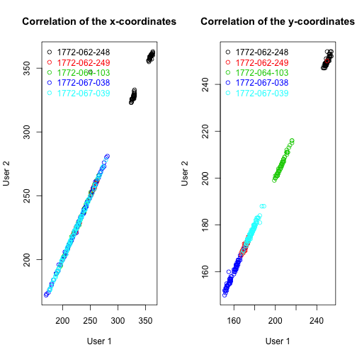
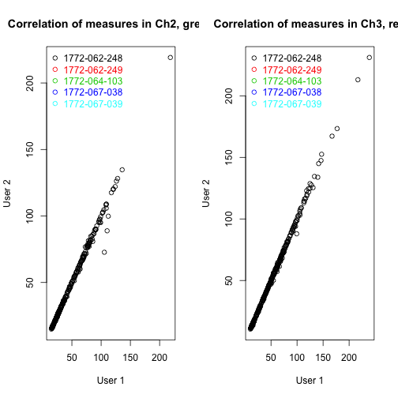
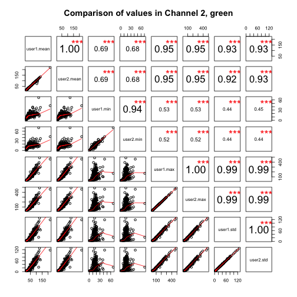
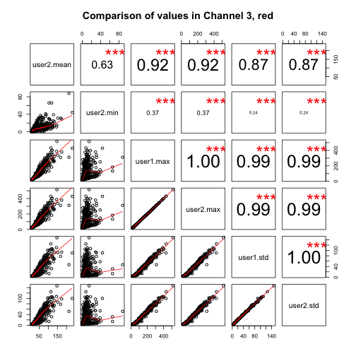
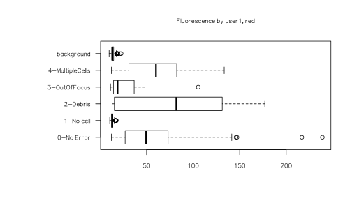
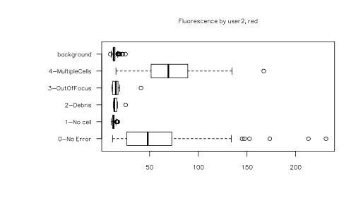

```
## Error in eval(expr, envir, enclos): object 'opts_chunk' not found
```


```r
scriptName <- "SetArea_Measure_UserConfirm.ijm"
pdfName <- "Usage_of_ImageJ_macro_SetArea_Measure_UserConfirm.pdf"
resultsUser1 <- "Results_SetArea_Measure_UserConfirm_User1.txt"
resultsUser2 <- "Results_SetArea_Measure_UserConfirm_User2.txt"
```

## Summary

Images of *Fucci* cells loaded in the C1 capture array, were taken before cell lysis. 
Three modes have been used for imaging: bright field (BF), Green and Red. 
[Raw images](https://briefcase.riken.jp/public/mAF8gAzoLsdAVPwBXp1LS5HJzGlicAWQZwlMer8hKu5U) in the
Cellomics specific C01 format were used for measuring fluorescence intensities and reporting errors in 
[Fiji ImageJ](http://fiji.sc/Fiji). All platforms version by using the macro [SetArea_Measure_UserConfirm.ijm](SetArea_Measure_UserConfirm.ijm).
The usage of this macro is illustrated in the accompanying PDF file [Usage_of_ImageJ_macro_SetArea_Measure_UserConfirm.pdf](Usage_of_ImageJ_macro_SetArea_Measure_UserConfirm.pdf). 
The macro will ask the user to select the directory which contains all the raw image files. 
The following procedures are done:  

* Open images one by one: first bright field, then Green, then Red channel images
* Draw a circular area with a diameter of 13 pixels on the bright field image
* Open dialogue box and and wait for the user to place the circle over the cell
* Measure fluorescence intensities on this defined area for teh Green and Red channel image, and measure background intensity levels 100 x 50 pixels adjacent to the cell (unless position is changed by the user)
* Open dialogue box and ask the user for an error report: comment and error type
* Record the file name, coordinates, size of area, mean intnsity, standard deviation, minimum and maximum intensities and an Error report
* Repeat the previous steps for every set of three images in the folder

The Fiji ImageJ macro was run independently by Elo Madissoon, User 1 (file [Results_SetArea_Measure_UserConfirm_User1.txt](Results_SetArea_Measure_UserConfirm_User1.txt))
and Michael Böttcher, User 2 (file [Results_SetArea_Measure_UserConfirm_User2.txt](Results_SetArea_Measure_UserConfirm_User2.txt)). 
The current document explains the [column names](#names) in the results file, 
analyzes the [consistency](#consistency) of the measurements, compares and finds consensus in the 
[error reporting](#errorreport) and gives an [overview](#overview) of the final values.

### <a name='names'>Column names</a>

### `cell_id`

Identifier of the well, which is the common part of the filename for all channels (bright field, red and green)

### `cell_coord_x` and `cell_coord_y`

Pixel coordinates of the upper left corner of the smallest rectangle that completely contain the selection area.

### `area`

Size of the selection area.

### `mean`, `std`, `min`, `max`

mean, standard deviation, minimum and maximum fluorescence intensity in the selection. 
Corresponding measurements to the background area (adjacent to the cell) when prefix is "bg." 
and to green channel or red channel when the suffix is ".ch2" or ".ch3" correspondingly.

### `Error`

The error types:
- "0-No Error" (default)
- "1-No cell"
- "2-Debris"
- "3-OutOfFocus"
- "4-MultipleCells"

### `Comment`

Write additional notes here, if necessary. Deafults to "No comment"

### `Fluo_QC`

A boolean value is given to each cell depending on the error type (e.g. "0-No Error" corresponds to FALSE)


### <a name='consistency'>Consistency of ImageJ measurements</a>

Load the fluorescence results files and summarise the content.


```r
panel.cor <- function(x, y, digits=2, prefix="", cex.cor) {
    usr <- par("usr"); on.exit(par(usr)) 
    par(usr = c(0, 1, 0, 1)) 
    r <- abs(cor(x, y)) 
    txt <- format(c(r, 0.123456789), digits=digits)[1] 
    txt <- paste(prefix, txt, sep="") 
    if(missing(cex.cor)) cex <- 0.8/strwidth(txt) 
 
    test <- cor.test(x,y) 
    
    signif <- symnum(test$p.value, corr = FALSE, na = FALSE, 
                  cutpoints = c(0, 0.001, 0.01, 0.05, 0.1, 1),
                  symbols = c("***", "**", "*", ".", " ")) 
 
    text(0.5, 0.5, txt, cex = cex * r) 
    text(.8, .8, signif, cex=cex, col=2) 
}

user1 <- read.table(resultsUser1, header=TRUE, sep="\t", row.names=1)
user2 <- read.table(resultsUser2, header=TRUE, sep="\t", row.names=1)
colnames(user2)
```

```
##  [1] "cell_id"        "cell_coord_x"   "cell_coord_y"   "area"           "mean_ch2"       "std_ch2"       
##  [7] "min_ch2"        "max_ch2"        "bg_coord_ch2_x" "bg_coord_ch2_y" "bg_area_ch2"    "bg_mean_ch2"   
## [13] "bg_std_ch2"     "bg_min_ch2"     "bg_max_ch2"     "area_ch3"       "mean_ch3"       "std_ch3"       
## [19] "min_ch3"        "max_ch3"        "bg_coord_ch3_x" "bg_coord_ch3_y" "bg_area_ch3"    "bg_mean_ch3"   
## [25] "bg_std_ch3"     "bg_min_ch3"     "bg_max_ch3"     "Error"          "Comment"
```

The cell location has to be manually set for all bright field images. The correalation of the cell coordinates reflects reproducibility of the cell location determination. The correlation of fluorescence intensities reflects the reproducibility of the results. The correlation between cell coordinates and fluorescence values is plotted, color coded by Run.


```r
subb <- substr(user1$cell_id, 1, 12)
mfrow.orig <- par(mfrow=c(1,2))
plot(user1$cell_coord_x, user2$cell_coord_x, col=as.factor(subb), main="Correlation of the x-coordinates", xlab="User 1", ylab="User 2")
legend("topleft", legend=c(levels(as.factor(subb))), pch=1, col=c(1:5), text.col=c(1:5), bty="n")
plot(user1$cell_coord_y, user2$cell_coord_y, col=as.factor(subb), main="Correlation of the y-coordinates", xlab="User 1", ylab="User 2")
legend("topleft", legend=c(levels(as.factor(subb))), pch=1, col=c(1:5), text.col=c(1:5), bty="n")
```

 

```r
plot(user1$mean_ch2, user2$mean_ch2, main="Correlation of measures in Ch2, green", xlab="User 1", ylab="User 2")
legend("topleft", legend=c(levels(as.factor(subb))), pch=1, col=c(1:5), text.col=c(1:5), bty="n")
plot(user1$mean_ch3, user2$mean_ch3, main="Correlation of measures in Ch3, red", xlab="User 1", ylab="User 2")
legend("topleft", legend=c(levels(as.factor(subb))), pch=1, col=c(1:5), text.col=c(1:5), bty="n")
```

 

The cell loacation and fluorescence mean values correlate with each other between the two repeated measurements.  

The mean, minimum, maximum and standard deviation are expected to correlate among themselves, in both green and red channel and between the two independent scorings.


```r
pairs(cbind(user1.mean = user1$mean_ch2, user2.mean = user2$mean_ch2, user1.min = user1$min_ch2, user2.min = user2$min_ch2, user1.max = user1$max_ch2, user2.max = user2$max_ch2, user1.std = user1$std_ch2, user2.std = user2$std_ch2), lower.panel=panel.smooth, upper.panel=panel.cor, main="Comparison of values in Channel 2, green")
```

 

```r
pairs(cbind(user1.mean = user1$mean.ch3, user2.mean = user2$mean_ch3, user1.min = user1$min.ch3, user2.min = user2$min_ch3, user1.max = user1$max_ch3, user2.max = user2$max_ch3, user1.std = user1$std_ch3, user2.std = user2$std_ch3), lower.panel=panel.smooth, upper.panel=panel.cor, main="Comparison of values in Channel 3, red")
```

 

Mean, maximum and standard deviation correlate well with each other in both channels for both scorings. The minimum values are not correlating as good. This can be explained the by lower range of values and different distribution of fluorescence values inside the cell. The middle and nucleus of the cell is more fluorescent, while the membrane of the cell does not have any fluorescence in well focused images. 

Compare the intensity levels of fluroescence in respect to the error type and background.


```r
par(mfrow <- c(2,2))
```

```
## NULL
```

```r
mar.orig <- par(mar=c(5.1, 10.0, 4.1, 2.1))

flBoxplot <- function (DATA){
  title.2=paste("Fluorescence by ", deparse(substitute(DATA)),", green",sep="")
  title.3=paste("Fluorescence by ", deparse(substitute(DATA)),", red",sep="")
  y=c(as.character(DATA[,"Error"]), rep("background", nrow(DATA)))
  x.ch2=c(DATA[,"mean_ch2"],DATA[,"bg_mean_ch2"])
  x.ch3=c(DATA[,"mean_ch3"],DATA[,"bg_mean_ch3"])
  boxplot( x.ch2~y, main=title.2, las=1, horizontal=TRUE)
  boxplot( x.ch3~y, main=title.3, las=1, horizontal=TRUE)
}

flBoxplot(user1)
```

  

```r
flBoxplot(user2)
```

  

The low fluorescence value in wells with error *1-No cell* is expected and is similar to the background levels of fluorescence in both green and red channel. Cells classified as *2-Debris* could be defragmented cells, which have not lost their fluroescence, therefore the values are varying. The boxplots indicate that error report are different for *2-Debris* definition between two scorings. 

### <a name='errorreport'>Error report</a>

Observe the number of similar and different error scores between User 1 and User 2 and the number of various classifications for both scorings.


```r
summary(user1$Error == user2$Error)
```

```
##    Mode   FALSE    TRUE    NA's 
## logical      44     334       0
```

```r
cbind(user1.error = summary(user1$Error), user2.error = summary(user2$Error))
```

```
##                 user1.error user2.error
## 0-No Error              277         297
## 1-No cell                52          43
## 2-Debris                  7          13
## 3-OutOfFocus             22          10
## 4-MultipleCells          20          15
```

The error reportings differ between the two observers. Display the wells where reports differ, but at least one report has "0-No Error". Add `Comment` column from User 2, since there were no comments from User 1 for these cells.


```r
# Error report differences
diff <- user1$Error!=user2$Error
differ <- cbind(cell=as.character(user1$cell_id), user1.comment = as.character(user1$Comment), user1.error = as.character(user1$Error), user2.error = as.character(user2$Error), user2.comment = as.character(substr(user2$Comment,1,45)))[diff,]
difference <- differ[(differ[,"user1.error"] == "0-No Error") | (differ[,"user2.error"] == "0-No Error"),]
levels(as.factor(difference[,"user1.comment"]))
```

```
## [1] "No comment"
```

```r
length(levels(as.factor(difference[,"user2.comment"])))
```

```
## [1] 13
```

```r
d=data.frame(difference[order(difference[,"user1.error"]),-2])
d
```

```
##                cell     user1.error     user2.error                                 user2.comment
## 1  1772-062-248_B04      0-No Error        2-Debris                                    No comment
## 2  1772-062-249_C08      0-No Error        2-Debris                             cell looks broken
## 3  1772-062-249_C11      0-No Error 4-MultipleCells                                    No comment
## 4  1772-062-249_E08      0-No Error        2-Debris                   cell does not looks damaged
## 5  1772-064-103_E03      0-No Error        2-Debris                                    No comment
## 6  1772-067-038_G03      0-No Error        2-Debris cell not in capture area and has strange shap
## 7  1772-067-039_H12      0-No Error 4-MultipleCells                                    No comment
## 8  1772-067-038_F09       1-No cell      0-No Error                                    No comment
## 9  1772-067-038_H10       1-No cell      0-No Error                                    No comment
## 10 1772-062-248_D09        2-Debris      0-No Error                                    No comment
## 11 1772-062-249_E06        2-Debris      0-No Error                                    No comment
## 12 1772-064-103_C01        2-Debris      0-No Error something was in background of cell; maybe a 
## 13 1772-067-038_D12        2-Debris      0-No Error                                    No comment
## 14 1772-062-248_A04    3-OutOfFocus      0-No Error         green fl. slightly larger than circle
## 15 1772-062-248_C03    3-OutOfFocus      0-No Error          green and red fl. larger than circle
## 16 1772-062-248_C04    3-OutOfFocus      0-No Error green and red fl. slightly larger than circle
## 17 1772-062-248_C05    3-OutOfFocus      0-No Error          green and red fl. larger than circle
## 18 1772-062-248_C07    3-OutOfFocus      0-No Error green and red fl. slightly larger than circle
## 19 1772-062-248_C10    3-OutOfFocus      0-No Error                       no fl., but normal cell
## 20 1772-062-248_D01    3-OutOfFocus      0-No Error               red fl. much larger than circle
## 21 1772-062-248_D06    3-OutOfFocus      0-No Error               red fl. much larger than circle
## 22 1772-062-248_D08    3-OutOfFocus      0-No Error     green and red fl. much larger than circle
## 23 1772-062-249_H03    3-OutOfFocus      0-No Error not sharp, but not too much out of focus eith
## 24 1772-067-039_D05    3-OutOfFocus      0-No Error                                    No comment
## 25 1772-062-249_D03 4-MultipleCells      0-No Error                                    No comment
## 26 1772-062-249_D11 4-MultipleCells      0-No Error                                    No comment
## 27 1772-062-249_E01 4-MultipleCells      0-No Error                                    No comment
## 28 1772-067-038_B11 4-MultipleCells      0-No Error                     might be more than 1 cell
## 29 1772-067-038_D04 4-MultipleCells      0-No Error                                    No comment
## 30 1772-067-038_D06 4-MultipleCells      0-No Error                                    No comment
## 31 1772-067-038_H01 4-MultipleCells      0-No Error                                    No comment
## 32 1772-067-038_H02 4-MultipleCells      0-No Error                                    No comment
## 33 1772-067-038_H07 4-MultipleCells      0-No Error                                    No comment
## 34 1772-067-039_E07 4-MultipleCells      0-No Error                                    No comment
```

There is inconsistency in the error reporting for 4 cells. A third opinion from coworkers was used to find consensus for the cells with at least one *0-No Error* by User 1 or User 2. All the cells with error *4-MultipleCells* by either User 1 or User 2 were decided to score as *0-No Error*. Six cells with *3-OutOfFocus* were decided to keep as *3-OutOfFocus* and five cells re-scored as *0-No Error*. 13 more cells with various errors were dicussed. The new scoring for cells with non-consensus was done as follows:


```r
d$error <- d$user2.error
d$error <- as.matrix(d$error)
d$error[d$user2.error == "4-MultipleCells",] <- "0-No Error"
Consensus_OutOfFocus <- c("1772-062-248_C03","1772-062-248_C04","1772-062-248_C05","1772-062-248_C10","1772-062-248_D06","1772-062-248_D08")
d$error[match(Consensus_OutOfFocus, d$cell),] <- "3-OutOfFocus"
Consensus_Discard <- c("1772-062-248_B04","1772-062-249_C08","1772-062-038_G03","1772-062-249_E06","1772-062-103_C01","1772-062-038_D12")
d$error[match(Consensus_Discard, d$cell),] <- "2-Debris"
Consensus_Keep <- c("1772-062-249_C11","1772-062-249_E08","1772-062-103_E03", "1772-062-039_H12","1772-062-038_F09","1772-067-038_H10","1772-062-248_D09")
d$error[match(Consensus_Keep, d$cell),] <- "0-No Error"

d[,c(-4)]
```

```
##                cell     user1.error     user2.error        error
## 1  1772-062-248_B04      0-No Error        2-Debris     2-Debris
## 2  1772-062-249_C08      0-No Error        2-Debris     2-Debris
## 3  1772-062-249_C11      0-No Error 4-MultipleCells   0-No Error
## 4  1772-062-249_E08      0-No Error        2-Debris   0-No Error
## 5  1772-064-103_E03      0-No Error        2-Debris     2-Debris
## 6  1772-067-038_G03      0-No Error        2-Debris     2-Debris
## 7  1772-067-039_H12      0-No Error 4-MultipleCells   0-No Error
## 8  1772-067-038_F09       1-No cell      0-No Error   0-No Error
## 9  1772-067-038_H10       1-No cell      0-No Error   0-No Error
## 10 1772-062-248_D09        2-Debris      0-No Error   0-No Error
## 11 1772-062-249_E06        2-Debris      0-No Error     2-Debris
## 12 1772-064-103_C01        2-Debris      0-No Error   0-No Error
## 13 1772-067-038_D12        2-Debris      0-No Error   0-No Error
## 14 1772-062-248_A04    3-OutOfFocus      0-No Error   0-No Error
## 15 1772-062-248_C03    3-OutOfFocus      0-No Error 3-OutOfFocus
## 16 1772-062-248_C04    3-OutOfFocus      0-No Error 3-OutOfFocus
## 17 1772-062-248_C05    3-OutOfFocus      0-No Error 3-OutOfFocus
## 18 1772-062-248_C07    3-OutOfFocus      0-No Error   0-No Error
## 19 1772-062-248_C10    3-OutOfFocus      0-No Error 3-OutOfFocus
## 20 1772-062-248_D01    3-OutOfFocus      0-No Error   0-No Error
## 21 1772-062-248_D06    3-OutOfFocus      0-No Error 3-OutOfFocus
## 22 1772-062-248_D08    3-OutOfFocus      0-No Error 3-OutOfFocus
## 23 1772-062-249_H03    3-OutOfFocus      0-No Error   0-No Error
## 24 1772-067-039_D05    3-OutOfFocus      0-No Error   0-No Error
## 25 1772-062-249_D03 4-MultipleCells      0-No Error   0-No Error
## 26 1772-062-249_D11 4-MultipleCells      0-No Error   0-No Error
## 27 1772-062-249_E01 4-MultipleCells      0-No Error   0-No Error
## 28 1772-067-038_B11 4-MultipleCells      0-No Error   0-No Error
## 29 1772-067-038_D04 4-MultipleCells      0-No Error   0-No Error
## 30 1772-067-038_D06 4-MultipleCells      0-No Error   0-No Error
## 31 1772-067-038_H01 4-MultipleCells      0-No Error   0-No Error
## 32 1772-067-038_H02 4-MultipleCells      0-No Error   0-No Error
## 33 1772-067-038_H07 4-MultipleCells      0-No Error   0-No Error
## 34 1772-067-039_E07 4-MultipleCells      0-No Error   0-No Error
```

Report from User 1 used for final fluorescence values. Prepare additional columns for `Run` and `Well`. Rename errors in `Error` column to match the consensus error report. Add `Fluo_QC` column for wells with consensus errors and outliers (fluorescence > 200). 


```r
user1$Well <- substr(user1$cell_id, 14, 16)
user1$Run <- as.factor(paste(substr(subb, 1, 4), substr(subb, 6, 8),substr(subb, 10, 13), sep="-"))
user1$Well <- as.factor(user1$Well)
user1$Error[match(d$cell, user1$cell_id)] <- d$error
user1$fluo_QC <- FALSE
user1[user1$Error != "0-No Error", "fluo_QC"] <- TRUE  
user1[user1$mean_ch3 > 200, "fluo_QC"] <- TRUE
user1[user1$mean_ch2 > 200, "fluo_QC"] <- TRUE
```

### <a name='overview'>Overview and Conclusions</a>

* The ImageJ macro produces reproducible results in the x and y coordinates and in the mean values of fluorescence
* The mean, standard deviation and maxium values correlate well with each other in both the green and the red channels
* A consensus was achieved with respect to the error type
* Fluorescence table was saved as `Results_fluorescence.txt`
* There are image files for 378 cells, and for 102 cells of the runs 1772-062-248, 1772-062-249 and 1772-064-103, some of the data was lost because of a case-sensitivity bug 


```r
summary(user1)
```

```
##              cell_id     cell_coord_x    cell_coord_y        area          mean_ch2         std_ch2       
##  1772-062-248_A01:  1   Min.   :170.0   Min.   :151.0   Min.   :214.6   Min.   : 14.93   Min.   :  3.810  
##  1772-062-248_A02:  1   1st Qu.:217.2   1st Qu.:166.2   1st Qu.:214.6   1st Qu.: 23.32   1st Qu.:  5.301  
##  1772-062-248_A03:  1   Median :233.5   Median :176.0   Median :214.6   Median : 29.80   Median :  8.095  
##  1772-062-248_A04:  1   Mean   :247.4   Mean   :188.4   Mean   :221.2   Mean   : 43.12   Mean   : 19.783  
##  1772-062-248_A05:  1   3rd Qu.:259.0   3rd Qu.:206.0   3rd Qu.:228.0   3rd Qu.: 60.15   3rd Qu.: 27.661  
##  1772-062-248_A06:  1   Max.   :363.0   Max.   :254.0   Max.   :228.0   Max.   :218.37   Max.   :128.649  
##  (Other)         :372                                                                                     
##     min_ch2         max_ch2       bg_coord_ch2_x  bg_coord_ch2_y   bg_area_ch2     bg_mean_ch2      bg_std_ch2   
##  Min.   : 0.00   Min.   : 25.00   Min.   :120.0   Min.   :161.0   Min.   :214.6   Min.   :14.94   Min.   :3.609  
##  1st Qu.: 9.00   1st Qu.: 38.00   1st Qu.:168.0   1st Qu.:216.0   1st Qu.:214.6   1st Qu.:16.93   1st Qu.:4.467  
##  Median :12.00   Median : 52.00   Median :183.5   Median :225.5   Median :214.6   Median :21.96   Median :4.670  
##  Mean   :12.95   Mean   : 91.26   Mean   :197.4   Mean   :237.9   Mean   :221.2   Mean   :20.86   Mean   :4.681  
##  3rd Qu.:16.00   3rd Qu.:128.50   3rd Qu.:209.0   3rd Qu.:255.8   3rd Qu.:228.0   3rd Qu.:22.87   3rd Qu.:4.889  
##  Max.   :67.00   Max.   :488.00   Max.   :313.0   Max.   :304.0   Max.   :228.0   Max.   :27.25   Max.   :5.501  
##                                                                                                                  
##    bg_min_ch2      bg_max_ch2       area_ch3        mean_ch3         std_ch3           min_ch3          max_ch3     
##  Min.   : 0.00   Min.   :24.00   Min.   :214.6   Min.   : 10.39   Min.   :  3.827   Min.   :  0.00   Min.   : 19.0  
##  1st Qu.: 6.00   1st Qu.:30.00   1st Qu.:214.6   1st Qu.: 16.70   1st Qu.:  4.872   1st Qu.:  4.00   1st Qu.: 30.0  
##  Median : 9.00   Median :34.00   Median :214.6   Median : 39.83   Median : 17.341   Median :  6.00   Median : 90.5  
##  Mean   : 8.68   Mean   :33.16   Mean   :221.2   Mean   : 47.88   Mean   : 27.816   Mean   :  9.68   Mean   :115.1  
##  3rd Qu.:11.00   3rd Qu.:36.00   3rd Qu.:228.0   3rd Qu.: 68.30   3rd Qu.: 43.501   3rd Qu.: 12.00   3rd Qu.:169.0  
##  Max.   :17.00   Max.   :42.00   Max.   :228.0   Max.   :238.86   Max.   :147.678   Max.   :116.00   Max.   :515.0  
##                                                                                                                     
##  bg_coord_ch3_x  bg_coord_ch3_y   bg_area_ch3     bg_mean_ch3       bg_std_ch3      bg_min_ch3       bg_max_ch3   
##  Min.   :120.0   Min.   :157.0   Min.   :214.6   Min.   : 9.701   Min.   :3.710   Min.   : 0.000   Min.   :18.00  
##  1st Qu.:168.0   1st Qu.:216.0   1st Qu.:214.6   1st Qu.:12.560   1st Qu.:4.166   1st Qu.: 1.000   1st Qu.:23.00  
##  Median :183.5   Median :225.5   Median :214.6   Median :13.212   Median :4.351   Median : 3.000   Median :25.00  
##  Mean   :197.4   Mean   :237.9   Mean   :221.2   Mean   :13.797   Mean   :4.351   Mean   : 2.794   Mean   :25.31  
##  3rd Qu.:209.0   3rd Qu.:255.8   3rd Qu.:228.0   3rd Qu.:14.575   3rd Qu.:4.524   3rd Qu.: 4.000   3rd Qu.:27.00  
##  Max.   :313.0   Max.   :304.0   Max.   :228.0   Max.   :22.664   Max.   :5.069   Max.   :10.000   Max.   :34.00  
##                                                                                                                   
##              Error                           Comment         Well               Run      fluo_QC       
##  0-No Error     :293   BG XY change              :  1   C07    :  5   1772-062-248:62   Mode :logical  
##  1-No cell      : 50   BG change XY              :  1   C08    :  5   1772-062-249:62   FALSE:290      
##  2-Debris       :  8   No comment                :373   C11    :  5   1772-064-103:62   TRUE :88       
##  3-OutOfFocus   : 17   Small cell or debris?     :  2   C12    :  5   1772-067-038:96   NA's :0        
##  4-MultipleCells: 10   Very small cell or debris?:  1   D01    :  5   1772-067-039:96                  
##                                                         D02    :  5                                    
##                                                         (Other):348
```

```r
write.table(user1, "Results_fluorescence.csv", sep=",")
sessionInfo()
```

```
## R version 3.1.0 (2014-04-10)
## Platform: x86_64-apple-darwin13.1.0 (64-bit)
## 
## locale:
## [1] C
## 
## attached base packages:
## [1] stats     graphics  grDevices utils     datasets  base     
## 
## loaded via a namespace (and not attached):
## [1] evaluate_0.5.5 formatR_1.0    knitr_1.8      stringr_0.6.2  tools_3.1.0
```
